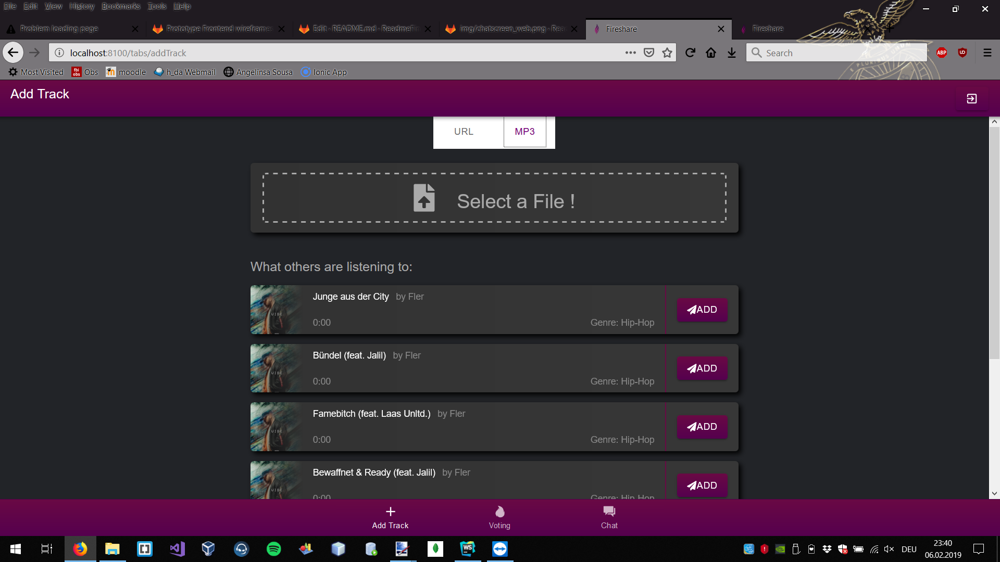

# Group_Play

> Starting the ionic frontend: go to ```/ionic/fireshare``` and enter the command ```ionic serve``` or ```ionic cordova run android```

> Starting the backend: go to ```/backend``` and enter the command ```npm start```.
This will open the server to listen on which ever port is set in the 'PORT' environment variable,
to choose a specific port on a unix base (sub-)system, type ```PORT=<yourPort> npm start```.

# Definition MVP
> this section is meant to give an detailed overview over the exact functionality that the MVP for the
project will provide.

### Backend (WIP)
The back end will manage the following data structures: 
* A map of Songs with their corresponding vote count.
* A cache for holding the next 'n' mp3s uploaded by peers, to feed the music stream with.
* One currently playing song.
* List of rooms

It will have the following endpoints to manage these data structures:

Room control:
GET /hostRoom >> generates new room and inserts the hosting user into the data structure
POST /joinRoom >> inserts peer into the data structure

Method|extension|body
---|---|---
GET | /voting |
GET | /chat |
PUT | /\<roomID\>/upload|*mp3-blob*
GET | /\<roomID\>/stream|

## Installation

Es genügt zum Installieren der Bibliotheken für das Backend und Ionic in die jeweiligen Verzeichnisse zu wechseln und  _npm install_ auszuführen.
Sollte dies nicht klappen kann man auch folgende Bibliotheken einzeln installieren:

### Ionic
Dependencies:
```
npm install --save-dev @angular-devkit/build-angular

npm install socket.io

npm install -g ionic cordova

ionic cordova plugin add cordova-plugin-background-mode

npm install --save @ionic-native/background-mode@beta

npm install ngx-youtube-player

npm install @ionic-native/music-controls
```

### Backend
Dependencies:
```
npm install socket.io
npm install cors
```
**Die Backend Serveradresse muss angepasst werden falls das Projekt auf einem Emulator/Android Gerät ausgeführt werden soll hierzu einfach die IP-adresse des Rechners anstelle von localhost eintragen.
 Siehe _ionic/fireshare/src/environments/environment.ts_! (Von Werk aus localhost:3000! & localhost:3000/uploads)**

### Share Intent
Add following Code to your AndroidManifest (platforms\android\app\src\main\AndroidManifest.xml):
```
<intent-filter>
    <action android:name="android.intent.action.SEND" />
    <category android:name="android.intent.category.DEFAULT" />
    <data android:mimeType="text/plain" />
</intent-filter>
```
# View & Function
## Homescreen (Web)

 - You can create a Room
 - You can Join a Room
 

## Votingscreen (Web)

 - You can Vote for Tracks 
 - You can Play/Pause and play next song as a Host
 

## Chatscreen (Web)

 - You can write Chat messages with other Roommembers
 

## Add Track URL (Web)

 - You can add Soundcloud & Youtube links
 - You can Search Youtube for song reccomendations

## Add Track Mp3 (Web)

 - You can upload Mp3 Songs
 - You can see what Mp3 Songs were already uploaded from other Users